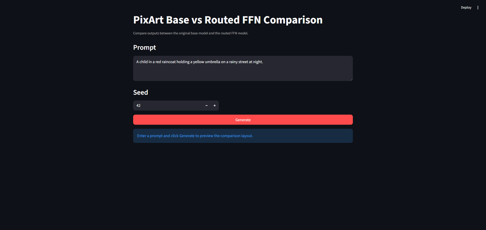
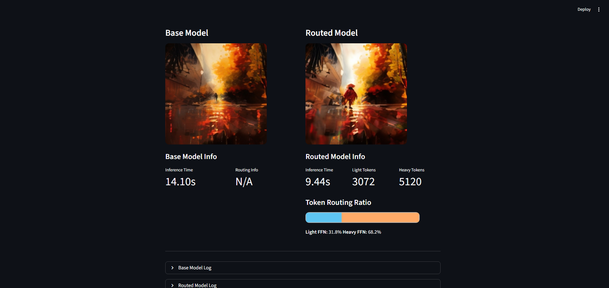

# Capacity-Routed FFNs for Efficient PixArt-α

We propose a token-adaptive routed FFN for PixArt-α that dynamically allocates computation per token, reducing unnecessary FFN operations while maintaining image quality during inference.

---

## Table of Contents

1. [Environment Setup](#environment-setup)
2. [GUI Inference](#gui-inference)
3. [CLI-Inference](#cli-inference)
4. [Training](#training)

---

## Environment Setup

### Option 1: Using Conda (Recommended)

1. **Create the Conda environment:**
   ```bash
   conda env create -f environment.yml
   ```

2. **Activate the environment:**
   ```bash
   conda activate PixArt
   ```

3. **Verify installation:**
   ```bash
   python -c "import torch; print(torch.cuda.is_available())"
   ```

### Option 2: Using pip with requirements.txt

1. **Create a virtual environment:**
   ```bash
   python -m venv pixart_env
   ```

2. **Activate the virtual environment:**
   - **Windows:**
     ```bash
     pixart_env\Scripts\activate
     ```
   - **Linux/Mac:**
     ```bash
     source pixart_env/bin/activate
     ```

3. **Install dependencies:**
   ```bash
   pip install -r requirements.txt
   ```

4. **Verify installation:**
   ```bash
   python -c "import torch; print(torch.cuda.is_available())"
   ```

---

## GUI Inference

### Launch the Streamlit Web Interface

1. **Ensure your environment is activated:**
   ```bash
   conda activate PixArt
   # or
   source pixart_env/bin/activate
   ```

2. **Start the Streamlit app:**
   ```bash
   streamlit run GUI/streamlit.py
   ```

3. **Access the UI:**
   - Open your browser and navigate to: `http://localhost:8501`

### Using the GUI

1. **Enter a prompt** in the text area (e.g., "A child in a red raincoat holding a yellow umbrella")

2. **Set the seed** for reproducibility

3. **Click Generate** to:
   - Run inference on both Base and Routed models
   - Compare generated images side-by-side
   - View inference time and token routing statistics

#### GUI Screenshots


 
 

### Output Interpretation

- **Base Model**: Original PixArt model results
- **Routed Model**: PixArt with Routed FFN optimization
- **Token Routing Ratio**: Percentage of tokens processed by Low-Capacity vs High-Capacity FFN modules
  - **Low-capacity FFN**: Faster, lower-quality computation path
  - **High-capacity FFN**: Slower, higher-quality computation path
- **Inference Time**: Total time to generate the image
- **Token Counts**: Number of tokens routed to each FFN type

### Gallery

#### Model Comparison Examples

<div align="center">

| **Base Model** | **Routed** |
|---|---|
|  |  |

</div>


---

## Pretrained Checkpoints

Before running GUI or CLI inference, you must place the pretrained model weights in the expected checkpoint paths.

- Base model checkpoint:
  - `output/Base_Model/Base256x256.pth`
  - Download from: https://huggingface.co/PixArt-alpha/PixArt-alpha/blob/main/PixArt-XL-2-256x256.pth
- Routed model checkpoint:
  - `output/Routed_Model/Routed256x256.pth`
  - Download from: https://drive.google.com/file/d/1hswvJdeTVBWMikeShsyCuz33pmmtPidv/view?usp=sharing


Additionally, inference requires VAE and T5 encoder weights:

- VAE weights:
  - `output/pretrained_models/sd-vae-ft-ema/`
  - This should contain the `sd-vae-ft-ema` model files.
  - Download from: https://huggingface.co/stabilityai/sd-vae-ft-ema/tree/main
- T5 weights:
  - `output/pretrained_models/t5_ckpts/t5-v1_1-xxl/`
  - This should contain the `t5-v1_1-xxl` tokenizer and encoder files.
  - Download from: https://huggingface.co/google/t5-v1_1-xxl/tree/main

If your machine has internet access, the VAE and T5 files will normally be downloaded automatically when first running inference. If you need to install them manually, download from the appropriate source and place them into the directories above.

If the directories do not exist yet, create them first:

```bash
mkdir -p output/Base_Model
mkdir -p output/Routed_Model
mkdir -p output/pretrained_models/sd-vae-ft-ema
mkdir -p output/pretrained_models/t5_ckpts/t5-v1_1-xxl
```

---

## Inference

### CLI Inference

Generate images from the command line using `tools/infer_pixart.py`:

#### Basic Inference

```bash
python tools/infer_pixart.py \
  configs/pixart_config/PixArt_xl2_img256_small_Routed.py \
  output/Routed_Model/Routed256x256.pth \
  --prompt "A child playing in a park" \
  --output_dir ./your_output_dir \
  --seed your_seed_number \
```

#### With Routing Statistics

Enable token routing analysis for Routed models:

```bash
python tools/infer_pixart.py \
  configs/pixart_config/PixArt_xl2_img256_small.py \
  output/Routed_Model/Routed256x256.pth \
  --prompt "A child playing in a park" \
  --output_dir ./your_output_dir \
  --seed your_seed_number \
  --collect_stats
```

#### Base Model Inference
```bash
PYTHONPATH=. python tools/infer_pixart_withembedding.py \
  configs/pixart_config/PixArt_xl2_img256_small.py \
  output/Base_Model/Base256x256.pth \
  --prompt "A child playing in a park" \
  --output_dir ./InferenceDatas/Original \
  --seed 42
```
## Training

### Train Routed FFN Model

1. **Prepare your dataset** in the appropriate format (see `diffusion/data/datasets/`)

   By default, the routed training config uses:
   - `config.data_root = 'data'`
   - `config.data.root = 'coco_train'`

   That means the training data should be placed under:
   ```bash
   ./data/coco_train/
   ```

   Required subfolders and files:
   ```bash
   ./data/coco_train/partition/data_info.json
   ./data/coco_train/images/<...>.jpg
   ./data/coco_train/caption_feature_wmask/<...>.npz
   ./data/coco_train/img_vae_features_256resolution/noflip/<...>.npy
   ```

   The dataset loader expects:
   - `partition/data_info.json`: metadata list with `path`, `prompt`, `ratio`, etc.
   - `images/`: raw training jpg/png images
   - `caption_feature_wmask/`: precomputed caption feature `.npz` files
   - `img_vae_features_256resolution/noflip/`: precomputed VAE feature `.npy` files

2. **Configure training parameters** in your chosen config file:
   ```bash
   configs/pixart_config/PixArt_xl2_img256_small_Routed.py
   ```

3. **Run training:**
   ```bash
    PYTHONPATH=. python \
      train_scripts/train_routed.py \
      configs/pixart_config/PixArt_xl2_img256_small_Routed.py \
      --work-dir your_output_dir \
      --load-from PixArt-XL-2-256x256.pth
   ```